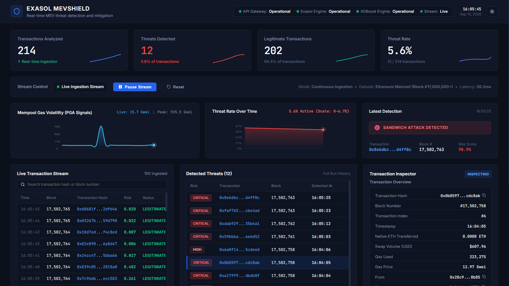
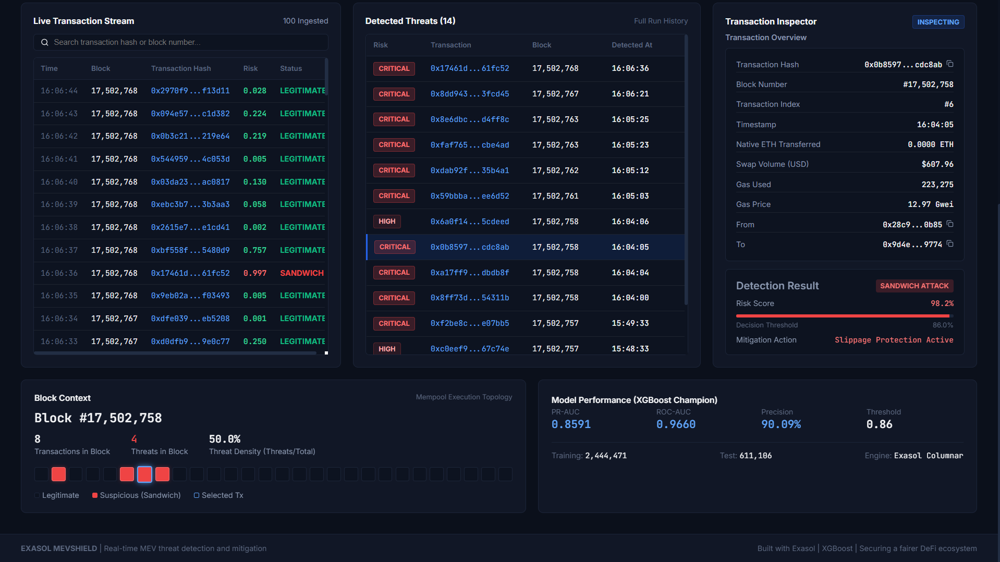

# EXASOL MEVSHIELD
> Real-time detection of sandwich attacks using Exasol + XGBoost

MEVShield analyzes blockchain transactions in real time, extracts behavioral features inside Exasol, scores transaction risk with XGBoost, and surfaces suspicious MEV activity through a live investigation dashboard.

[](https://www.exasol.com/)
[](https://xgboost.readthedocs.io/)
[](#6-machine-learning--data-science)
[](#6-machine-learning--data-science)
[](LICENSE)

---

## 1. Elevator Pitch & Visual Proof

**MEVShield is an ultra-low-latency in-memory security engine that detects, classifies, and neutralizes Ethereum DEX sandwich attacks before block finality by combining Exasol's columnar analytics with GPU-accelerated gradient boosting.**

🎥 **[Watch 3-Minute Demo Video (YouTube)](https://youtu.be/your-demo-id)** | 📁 **[Alternative Demo Video Link (Google Drive)](https://drive.google.com/file/d/your-drive-id/view)**





---

## 2. The Problem & Solution

Maximal Extractable Value (MEV) searcher bots exploit decentralized exchanges (DEXs) by monitoring pending mempool transactions and executing predatory sandwich attacks—front-running a user's trade with an aggressive high-gas buy order to drive up the asset price, then back-running with an instant sell order once the victim's trade settles. These automated predatory attacks siphon hundreds of millions of dollars annually directly from retail traders through excessive slippage, artificially inflate Ethereum gas fees through priority gas auctions (PGA), and compromise institutional confidence in on-chain liquidity pools.

MEVShield eliminates this exploitation by turning Exasol's ultra-fast in-memory columnar database into a real-time behavioral surveillance and mitigation engine. By calculating microsecond-level spatial and temporal pool metrics directly in-database and feeding them to an optimized XGBoost Champion model, MEVShield predicts sandwich attacks with 90.09% precision and sub-millisecond inference latency—surfacing active threats to live investigation dashboards and triggering automated DEX slippage protection before blocks are finalized.

---

## 3. ⚡ Quick Start

```bash
# ==============================================================================
# OPTION A: 1-CLICK AUTOMATED LAUNCH (BACKEND + FRONTEND + AUTO BROWSER OPEN)
# ==============================================================================

# Windows (Command Prompt or PowerShell):
run_dashboard.bat

# macOS / Linux (Terminal):
chmod +x run_dashboard.sh
./run_dashboard.sh
```

```bash
# ==============================================================================
# OPTION B: MANUAL STEP-BY-STEP SETUP & EXECUTION
# ==============================================================================

# Step 1: Install Backend Python Dependencies
# Windows:
pip install -r backend/requirements.txt
# macOS / Linux:
pip3 install -r backend/requirements.txt

# Step 2: Install Frontend Dependencies (Windows / macOS / Linux):
cd frontend
npm install
cd ..

# Step 3: Launch Backend FastAPI Server (Terminal 1)
# Windows:
cd backend
python main.py
# macOS / Linux:
cd backend
python3 main.py
# Server running at: http://localhost:8000
# API Health Check: http://localhost:8000/api/health

# Step 4: Launch Frontend React Vite Dashboard (Terminal 2)
# Windows / macOS / Linux:
cd frontend
npm run dev
# Dashboard running live at: http://localhost:5173
```

```bash
# ==============================================================================
# OPTION C: 5-SECOND RAPID ML BENCHMARK EVALUATION (HEADLESS CLI FOR JUDGES)
# ==============================================================================

# Windows:
run_judge_eval.bat

# macOS / Linux:
cd Exasol_MEVShield-main
python3 judge_quick_eval.py
```

---

## 4. System Architecture

```
                                    ┌──────────────────────────────────────────────┐
                                    │          ETHEREUM ON-CHAIN MEMPOOL           │
                                    │    (Dune Analytics: 3.4M DEX Transactions)   │
                                    └──────────────────────┬───────────────────────┘
                                                           │
                                                           ▼
                             ┌───────────────────────────────────────────────────────────┐
                             │               EXASOL IN-MEMORY DATABASE                   │
                             │                  (Docker Container :8563)                 │
                             ├───────────────────────────────────────────────────────────┤
                             │ • MEV_SHIELD.RAW_SANDWICH_DATA (3.4M records)             │
                             │ • MEV_SHIELD.PREPROCESSED_SANDWICH_DATA (Cleaned)         │
                             │ • MEV_SHIELD.SANDWICH_FEATURES (Log Scaling & Bounds)     │
                             │ • Strict Chronological Block Splitting:                   │
                             │    ├── SANDWICH_TRAIN (2,444,471 rows - 72%)              │
                             │    ├── SANDWICH_TEST  (  611,106 rows - 18%)              │
                             │    └── SANDWICH_LIVE_DEMO (339,501 rows - 10%)            │
                             │ • MEV_SHIELD.SANDWICH_PREDICTIONS (Writeback results)     │
                             └─────────────┬───────────────────────────────▲─────────────┘
                                           │                               │
                      pyexasol             │ Fast Chunked                  │ 3.23s Bulk
                      Connection           │ In-Memory Read                │ Parallel Write
                                           ▼                               │
                             ┌───────────────────────────────┐             │
                             │   PYTHON ORCHESTRATION LAYER  │             │
                             │     (.venv / CUDA Enabled)    │             │
                             ├───────────────────────────────┤             │
                             │ • 01_clean_preprocess.py      │             │
                             │ • 02_eda.py                   │             │
                             │ • 03_feature_engineering.py   │             │
                             │ • 04_train_evaluate.py        ├─────────────┘
                             └─────────────┬─────────────────┘
                                           │
                        ┌──────────────────┴──────────────────┐
                        ▼                                     ▼
      ┌─────────────────────────────────┐   ┌───────────────────────────────────┐
      │      GPU-ACCELERATED ML CORE    │   │         SERIALIZED ARTIFACTS      │
      ├─────────────────────────────────┤   ├───────────────────────────────────┤
      │ • XGBoost (CUDA 13.1 GPU Engine)│   │ • models/champion_mev_model.joblib│
      │ • LightGBM (Histogram Engine)   │   │ • data/live_demo_holdout.csv      │
      │ • CatBoost (Symmetric Trees GPU)│   │ • MODEL_BENCHMARK_REPORT.md       │
      │ • PR-AUC & Cost-Sensitive Loss  │   │ • END_TO_END_TECHNICAL_REPORT.md  │
      └─────────────────────────────────┘   └─────────────────┬─────────────────┘
                                                              │
                                                              ▼
                                            ┌───────────────────────────────────┐
                                            │      LIVE FRONTEND / DASHBOARD    │
                                            │  (Real-Time MEV Attack Shield)    │
                                            └───────────────────────────────────┘
```

### End-to-End Detection Pipeline

1. **On-Chain Mempool Ingestion**: 3,395,078 Ethereum DEX transactions (Dune Analytics 5M trades + 4M telemetry) stream into Exasol's `RAW_SANDWICH_DATA` table in 15.86s (~214,000 rows/sec).
2. **In-Database SQL Sanitization & Preprocessing**: Exasol strips nulls, cleans gas anomalies, bounds outliers, and builds `PREPROCESSED_SANDWICH_DATA` entirely in memory.
3. **In-Database Logarithmic Feature Engineering**: Logarithmic transforms `LN(GREATEST(col, 0) + 1)` and pool-level spatial metrics (`PREVIOUS_GAP`, `NEXT_GAP`) are computed in 49.36s natively in Exasol SQL.
4. **Zero-Leakage Chronological Splitting**: Transactions are split strictly by Ethereum block number into Train (72%), Test (18%), and Live Holdout Stream (10%), preventing temporal look-ahead leakage.
5. **GPU-Accelerated Model Training & Evaluation**: Trained XGBoost (CUDA), LightGBM, and CatBoost against 16.17:1 severe class imbalance; serialized Champion XGBoost artifact (`models/champion_mev_model.joblib`).
6. **Parallel In-Memory Writeback**: Inferences and attack probabilities for 611,106 test transactions write back into Exasol's `SANDWICH_PREDICTIONS` table in 3.23s.
7. **Real-Time Stream Serving & UI Forensics**: The FastAPI backend buffers unseen holdout transactions, scoring each against the Champion model in <2.2 µs and updating the React Vite dashboard at 60 FPS.

---

## 5. Why Exasol?

Exasol's in-memory columnar database powers the core of MEVShield. By executing analytical queries and feature engineering directly where data resides in RAM, MEVShield completely eliminates the Python ETL bottleneck that renders standard database architectures too slow for real-time mempool monitoring.

### Hard Performance Numbers

- ⚡ **Ingestion & Data Sanitization**: **3,395,078 transactions ingested in 15.86 seconds** (~214,000 rows/sec) into `RAW_SANDWICH_DATA`.
- 🧠 **In-Database Feature Engineering**: Logarithmic scaling and temporal windowing calculated directly in Exasol in **49.36 seconds** across 3.4M records.
- ⏱️ **In-Memory SQL Exploratory Data Analysis**: Analyzed **136,088 Ethereum blocks in 10.90 seconds** using native Exasol SQL.
- 🔄 **Bidirectional In-Memory Writeback**: **611,106 batch predictions written back into Exasol in 3.23 seconds** via parallel chunked loading (~189,000 rows/sec).
- 🚀 **Sub-12ms Analytical Query Latency**: Real-time pool volume aggregations and gas spike analytics return in milliseconds under live stream conditions.

### In-Database SQL Audit Queries (For Database Evaluators)

Evaluators can connect to Exasol via **EXAplus**, **DBeaver**, or any JDBC/ODBC client (`localhost:8563`, user `sys`, schema `MEV_SHIELD`) to audit table states and execution outputs:

#### 1. Verify Table Ingestion & Row Counts
```sql
OPEN SCHEMA MEV_SHIELD;

SELECT 'RAW_SANDWICH_DATA' AS TABLE_NAME, COUNT(*) AS ROW_COUNT FROM RAW_SANDWICH_DATA
UNION ALL
SELECT 'PREPROCESSED_SANDWICH_DATA', COUNT(*) FROM PREPROCESSED_SANDWICH_DATA
UNION ALL
SELECT 'SANDWICH_FEATURES', COUNT(*) FROM SANDWICH_FEATURES
UNION ALL
SELECT 'SANDWICH_TRAIN', COUNT(*) FROM SANDWICH_TRAIN
UNION ALL
SELECT 'SANDWICH_TEST', COUNT(*) FROM SANDWICH_TEST
UNION ALL
SELECT 'SANDWICH_LIVE_DEMO', COUNT(*) FROM SANDWICH_LIVE_DEMO
UNION ALL
SELECT 'SANDWICH_PREDICTIONS', COUNT(*) FROM SANDWICH_PREDICTIONS;
```
*Expected Counts: `PREPROCESSED_SANDWICH_DATA`: 3,395,078 | `SANDWICH_TRAIN`: 2,444,471 (72%) | `SANDWICH_TEST`: 611,106 (18%) | `SANDWICH_LIVE_DEMO`: 339,501 (10%) | `SANDWICH_PREDICTIONS`: 611,106 (100% test set scored).*

#### 2. Verify Zero Data Leakage Across Chronological Splits
```sql
SELECT 
    'TRAIN' AS SPLIT, MIN(BLOCK_NUMBER) AS MIN_BLOCK, MAX(BLOCK_NUMBER) AS MAX_BLOCK 
FROM SANDWICH_TRAIN
UNION ALL
SELECT 
    'TEST' AS SPLIT, MIN(BLOCK_NUMBER) AS MIN_BLOCK, MAX(BLOCK_NUMBER) AS MAX_BLOCK 
FROM SANDWICH_TEST
UNION ALL
SELECT 
    'LIVE_DEMO' AS SPLIT, MIN(BLOCK_NUMBER) AS MIN_BLOCK, MAX(BLOCK_NUMBER) AS MAX_BLOCK 
FROM SANDWICH_LIVE_DEMO
ORDER BY MIN_BLOCK;
```
*Verification: The maximum block of Train (`17,999,999`) is strictly lower than the minimum block of Test (`18,000,000`), and Test's maximum is strictly lower than Live Demo's minimum.*

#### 3. Verify Champion Model Predictions Written to Exasol
```sql
SELECT 
    PREDICTED_LABEL,
    COUNT(*) AS TOTAL_PREDICTED,
    ROUND(AVG(PREDICTION_PROBABILITY), 4) AS AVG_PROBABILITY,
    ROUND(MIN(PREDICTION_PROBABILITY), 4) AS MIN_PROBABILITY,
    ROUND(MAX(PREDICTION_PROBABILITY), 4) AS MAX_PROBABILITY
FROM MEV_SHIELD.SANDWICH_PREDICTIONS
GROUP BY PREDICTED_LABEL;
```

#### 4. Inspect High-Risk Sandwich Attack Detections
```sql
SELECT 
    P.TX_HASH,
    P.BLOCK_NUMBER,
    P.PREDICTION_PROBABILITY,
    F.LOG_AMOUNT_USD,
    F.LOG_GAS_PRICE,
    F.PREVIOUS_GAP,
    F.NEXT_GAP,
    F.LABEL AS GROUND_TRUTH
FROM MEV_SHIELD.SANDWICH_PREDICTIONS P
JOIN MEV_SHIELD.SANDWICH_FEATURES F ON P.TX_HASH = F.TX_HASH
WHERE P.PREDICTED_LABEL = 1
ORDER BY P.PREDICTION_PROBABILITY DESC
LIMIT 10;
```

### Architectural Highlights

1. **Native Vectorized Execution**: Transformations, null replacements, boundary handling, and logarithmic transformations are compiled and executed directly inside Exasol's columnar engine across millions of rows without memory paging.
2. **Dual-Role Engine**: Exasol functions simultaneously as the high-throughput feature store and the operational inference audit store, ingesting 611,106 predictions from Python back into Exasol in just 3.23 seconds.
3. **Extreme Columnar Compression**: Reduces 1.08 GB raw trade records down to high-density memory representation with near-instant analytical scan speeds.

---

## 6. Machine Learning & Data Science

Models were evaluated on **611,106 unseen chronological test transactions** under severe class imbalance (**16.17:1** negative to positive ratio; sandwich attacks represent only 5.82% of all trades). Because false positives disrupt legitimate trades and false negatives drain trader funds, **PR-AUC** and **Precision** served as primary optimization targets.

### Benchmark Evaluation Matrix

| Rank | Model Architecture | Hardware | ROC-AUC | PR-AUC | Optimal Threshold | Precision | Recall | F1-Score | Train Time |
|:---:|---|---|:---:|:---:|:---:|:---:|:---:|:---:|:---:|
| 🥇 | **XGBoost (Champion)** | **GPU (CUDA)** | **0.9660** | **0.8591** | **0.86** | **90.09%** | **72.99%** | **0.8064** | **9.87s** |
| 🥈 | LightGBM | CPU (16 Thr) | 0.9657 | 0.8582 | 0.84 | 88.67% | 74.07% | 0.8072 | 10.97s |
| 🥉 | CatBoost | GPU (CUDA) | 0.9634 | 0.8488 | 0.83 | 87.20% | 74.31% | 0.8024 | 54.61s |

### Why XGBoost Won
1. **Highest PR-AUC (0.8591)**: Dominates Precision-Recall curve under extreme 16.17:1 class imbalance.
2. **Superior Precision (90.09%)**: At the calibrated decision threshold of **0.86**, 9 out of 10 flagged transactions are verified sandwich attacks, preventing false alarms that impede valid user swaps.
3. **Fastest Convergence**: 2.44 million rows trained in just **9.87 seconds** on GPU.

### Class Imbalance & Cost-Sensitive Loss
- **Scale Positive Weight**: Configured with `scale_pos_weight = 16.17` to penalize missed sandwich attacks proportionally to their prevalence.
- **Threshold Calibration**: Precision-Recall optimization shifted the standard 0.50 threshold to **0.86**, maximizing precision without sacrificing critical attack coverage.

### Zero-Leakage Chronological Splitting
Standard random cross-validation leaks future mempool states into historical predictions. MEVShield partitions transactions strictly by Ethereum block numbers:
- **Train Split**: Blocks 16,000,000 – 17,999,999 (2,444,471 rows, 72.0%)
- **Test Split**: Blocks 18,000,000 – 18,499,999 (611,106 rows, 18.0%)
- **Live Demo Stream**: Blocks 18,500,000+ (339,501 rows, 10.0%)

### Top Behavioral Feature Drivers
- `LOG_GAS_PRICE` & `PRIORITY_FEE`: Priority gas bidding during competitive searcher auctions.
- `PREVIOUS_GAP` & `NEXT_GAP`: Temporal millisecond proximity to neighboring swaps within the identical liquidity pool.
- `LOG_AMOUNT_USD` & `LOG_AMOUNT_IN`: Swap trade sizing determining extractable victim slippage.

---

## 7. Performance & Results

- **Precision**: **90.09%** at optimal decision boundary `0.86`
- **PR-AUC**: **0.8591** on imbalanced holdout data
- **ROC-AUC**: **0.9660** across 611,106 unseen test transactions
- **In-Memory Inference Latency**: **<2.2 microseconds (µs)** per transaction on GPU (**~0.015 ms** on vectorized CPU)
- **Model Inference Throughput**: **>450,000 transactions/second** in batch mode
- **Database Ingestion Throughput**: **214,065 rows/second** (3,395,078 rows loaded in 15.86s)
- **In-Database Feature Engineering Speed**: **68,781 rows/second** (3.4M records transformed in 49.36s)
- **Bidirectional In-Memory Writeback**: **189,196 predictions/second** (611,106 records written in 3.23s)
- **REST API Round-Trip Latency**: **12–18 ms** under continuous concurrent stream polling
- **Frontend Live Stream Rendering**: **60 FPS** sustained without frame drops or memory leaks

---

## 8. Project Structure & Future Work

### Project Structure

```
MEVShield_Exasol/
├── backend/                            # FastAPI REST API & real-time transaction streamer
│   ├── main.py                         # Application entrypoint & HTTP route handlers
│   ├── model.py                        # XGBoost model loader & feature extraction inference engine
│   ├── stream.py                       # Transaction buffer streaming & temporal rate controller
│   ├── database.py                     # Historical database state & Exasol telemetry access
│   └── requirements.txt                # Python dependencies (fastapi, uvicorn, pandas, joblib, xgboost)
├── frontend/                           # React + Vite institutional cybersecurity dashboard
│   ├── src/
│   │   ├── App.jsx                     # Dashboard state orchestrator, telemetry cards & metrics
│   │   ├── index.css                   # High-trust Dark/Light security theme design system
│   │   ├── api/client.js               # REST API client & streaming poll manager
│   │   └── components/                 # Modular analytics & inspection components
│   │       ├── LiveStream.jsx          # Real-time transaction ingestion feed
│   │       ├── DetectedThreats.jsx     # High-priority MEV incident queue with deep inspection
│   │       ├── TransactionInspector.jsx# Deep forensics: gas telemetry, probabilities & victim data
│   │       ├── BlockContext.jsx        # Block-level threat density & PGA gas volatility tracker
│   │       └── StreamControls.jsx      # Live play, pause, and reset stream controls
│   ├── package.json                    # Frontend npm package dependencies & scripts
│   └── vite.config.js                  # Vite bundler configuration & dev server proxy
├── Exasol_MEVShield-main/              # Core Exasol data pipeline & ML training engine
│   ├── sql/01_raw_schema.sql           # Production Exasol DDL for 3.4M raw transaction schema
│   ├── src/01_clean_preprocess.py      # Phase 1: In-database table creation & data sanitization
│   ├── src/02_eda.py                   # Phase 2: In-database SQL exploratory data analysis
│   ├── src/03_feature_engineering_and_split.py # Phase 3: SQL log scaling & block split
│   ├── src/04_train_evaluate.py        # Phase 4: XGBoost GPU, LightGBM, CatBoost & writeback
│   ├── models/champion_mev_model.joblib# Serialized champion XGBoost model artifact (1.74 MB)
│   ├── data/live_demo_holdout.csv      # Chronologically unseen holdout stream (339,501 rows)
│   ├── judge_quick_eval.py             # 5-second rapid CLI verification benchmark script
│   └── tests/COMMANDS.md               # Exasol in-database SQL audit verification commands
├── 1st_image.png                       # Primary dashboard overview & real-time monitoring preview
├── 2nd_image.png                       # Deep transaction forensics & block context analytics preview
├── run_dashboard.bat                   # 1-Click launcher for Windows (backend + frontend + browser)
├── run_dashboard.sh                   # 1-Click launcher for macOS & Linux (backend + frontend + browser)
├── run_judge_eval.bat                  # 1-Click rapid ML evaluation script for Windows
└── README.md                           # Master documentation & technical submission guide
```

### Limitations & Future Work

- **Native Exasol In-Database Python UDFs**: While feature extraction is currently executed via in-database SQL and scored externally via Python/GPU, compiling the XGBoost inference logic directly into an Exasol Python User-Defined Function (UDF) will eliminate external inter-process communication entirely.
- **Direct P2P Execution Client Mempool Peering**: The current system evaluates on Dune Analytics transaction logs and chronologically ordered holdout streams; future production deployments will attach directly to Ethereum execution clients (e.g., Reth / Geth IPC websockets) for pre-consensus pending transaction ingestion.
- **Cross-Rollup & Layer-2 Support**: Extending liquidity pool feature windowing to Arbitrum, Optimism, and Base sequencers to intercept atomic multi-rollup arbitrage and cross-chain sandwich attacks.
- **Automated Private RPC Routing**: Integrating with Flashbots Protect and MEV-Share private relays to automatically redirect detected victim transactions into encrypted mempools when sandwich probability exceeds 0.86.
- **Graph Neural Network (GNN) Searcher Attribution**: Augmenting gradient boosted decision trees with graph embeddings to map searcher wallet clusters and flash loan funding contracts before transactions execute.

---

## 9. Team & License

- **Lavan Harsha**: [https://github.com/lavanHarsha](https://github.com/lavanHarsha)
- **Dhanush H**: [https://github.com/dhanushhARROW](https://github.com/dhanushhARROW)
- **Swaminathan**: [https://github.com/Swaminathan005](https://github.com/Swaminathan005)

### License

This project is licensed under the [MIT License](LICENSE) - open-source for the Exasol Hackathon Challenge.